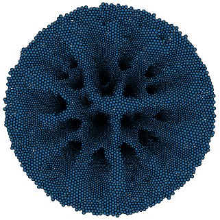

# Simulation of Systems of interacting mean-field Particles with High Efficiency

<p align="center">

</p>

Please visit the [website](https://sisyphe.readthedocs.io/en/latest/) for a full documentation.

------------------------------------------------------------------------------------------------


The SiSyPHE library builds on recent advances in hardware and software for the efficient simulation of **large scale interacting particle systems**, both on the **GPU** and on the CPU. The implementation is based on recent libraries originally developed for machine learning purposes to significantly accelerate tensor (array) computations, namely the [PyTorch](https://github.com/pytorch/pytorch) package and the [KeOps](https://www.kernel-operations.io/keops/index.html) library. The **versatile object-oriented Python interface** is well suited to the comparison of new and classical many-particle models, enabling ambitious numerical experiments and leading to novel conjectures. The SiSyPHE library speeds up both traditional Python and low-level implementations by **one to three orders of magnitude** for systems with up to **several millions** of particles. 

<p align="center">

</p>

## Citation 

If you use SiSyPHE in a research paper, please cite the [JOSS publication](https://joss.theoj.org/papers/10.21105/joss.03653#) :

```
@article{Diez2021,
  doi = {10.21105/joss.03653},
  url = {https://doi.org/10.21105/joss.03653},
  year = {2021},
  publisher = {The Open Journal},
  volume = {6},
  number = {65},
  pages = {3653},
  author = {Antoine Diez},
  title = {`SiSyPHE`: A Python package for the Simulation of Systems of interacting mean-field Particles with High Efficiency},
  journal = {Journal of Open Source Software}
}
```

Diez, A., (2021). SiSyPHE: A Python package for the Simulation of Systems of interacting mean-field Particles with High Efficiency. Journal of Open Source Software, 6(65), 3653, https://doi.org/10.21105/joss.03653

[](https://doi.org/10.21105/joss.03653)

## Installation 

### Requirements

- **Python 3** with packages **NumPy** and **SciPy** 
- **PyTorch** : version>= 1.5
- **PyKeops** : version>= 1.5

### Using pip

In a terminal, type:

```
pip install sisyphe
```
    
### On Google Colab

The easiest way to get a working version of SiSyPHE is to use the free virtual machines provided by [Google Colab](https://colab.research.google.com).

1. On a new Colab notebook, navigate to Edit→Notebook Settings and select GPU from the Hardware Accelerator drop-down.

2. Install PyKeops with the Colab specifications **first** by typing

```    
!pip install pykeops[colab]
```

3. Install SiSyPHE by typing 

```
!pip install sisyphe
```    

### Testing the installation

In a Python terminal, type 

```python
import sisyphe
sisyphe.test_sisyphe()
```    

<p align="center">

</p>   

## Contributing

Contributions to make SiSyPHE grow are warmly welcome! Examples of possible (and ongoing) developments include the following. 

* The implementation of new models.

* The implementation of more complex boundary conditions and of models on *non-flat* manifolds. 

* An improved visualization method (currently only basic visualization functions relying on [Matplotlib](https://matplotlib.org/) are implemented). 

Contributions can be made by opening an issue on the GitHub repository, via a pull request or by contacting directly the author.  


## Author

- [Antoine Diez](https://antoinediez.gitlab.io), Imperial College London 

### Acknowledgments

The development of this library would not have been possible without the help of [Jean Feydy](https://www.jeanfeydy.com/), his constant support and precious advice. This project was initiated by [Pierre Degond](https://sites.google.com/site/degond/) and has grown out of many discussions with him. 
