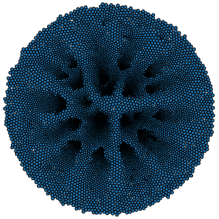

.. Sisyphe documentation master file, created by
   sphinx-quickstart on Thu Apr 29 16:21:29 2021.
   You can adapt this file completely to your liking, but it should at least
   contain the root `toctree` directive.

Simulation of Systems of interacting mean-field Particles with High Efficiency
**********************************************************

The SiSyPHE library builds on recent advances in hardware and software for the efficient simulation of **large scale interacting particle systems**, both on the **GPU** and on the CPU. The implementation is based on recent libraries originally developed for machine learning purposes to significantly accelerate tensor (array) computations, namely the `PyTorch <https://github.com/pytorch/pytorch>`_ package and the `KeOps <https://www.kernel-operations.io/keops/index.html>`_ library. The **versatile object-oriented Python interface** is well suited to the comparison of new and classical many-particle models, enabling ambitious numerical experiments and leading to novel conjectures. The SiSyPHE library speeds up both traditional Python and low-level implementations by **one to three orders of magnitude** for systems with up to **several millions** of particles. 

The project is hosted on `GitHub <https://github.com/antoinediez/Sisyphe>`_, under the permissive `MIT license <https://en.wikipedia.org/wiki/MIT_License>`_. |br|  
|PyPi version| 

Contributing
======================

Contributions to make SiSyPHE grow are warmly welcome! Examples of possible (and ongoing) developments include the following. 

* The implementation of new models.

* The implementation of more complex boundary conditions and of models on *non-flat* manifolds. 

* An improved visualization method (currently only basic visualization functions relying on `Matplotlib <https://matplotlib.org/>`_ are implemented). 

Contributions can be made by opening an issue on the GitHub repository, via a pull request or by contacting directly the author.  

Author
===========

`Antoine Diez <https://antoinediez.gitlab.io/>`_, Imperial College London 

Acknowledgments
-------------------

The development of this library would not have been possible without the help of `Jean Feydy  <https://www.jeanfeydy.com/>`_, his constant support and precious advice. This project was initiated by `Pierre Degond <https://sites.google.com/site/degond/>`_ and has grown out of many discussions with him. 

Table of contents
========================

.. toctree::
   :maxdepth: 2

   background.rst

.. toctree::
   :maxdepth: 2

   installation.rst

.. toctree::
   :maxdepth: 2

   benchmark.rst

.. toctree::
   :maxdepth: 2
   :caption: Tutorials and examples

   _auto_tutorials/index
   _auto_examples/index

.. toctree::
   :maxdepth: 2
   :caption: API

   api/API_particles
   api/API_models
   api/API_kernels
   api/API_sampling
   api/API_display
   api/API_toolbox
   

Indices and tables
==================

* :ref:`genindex`
* :ref:`modindex`
* :ref:`search`

.. |PyPi version| image:: https://img.shields.io/pypi/v/sisyphe?color=blue
   :target: https://pypi.org/project/sisyphe/
   
.. |br| raw:: html

   
